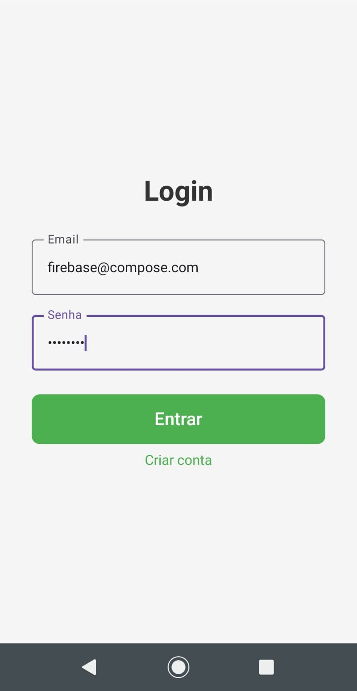
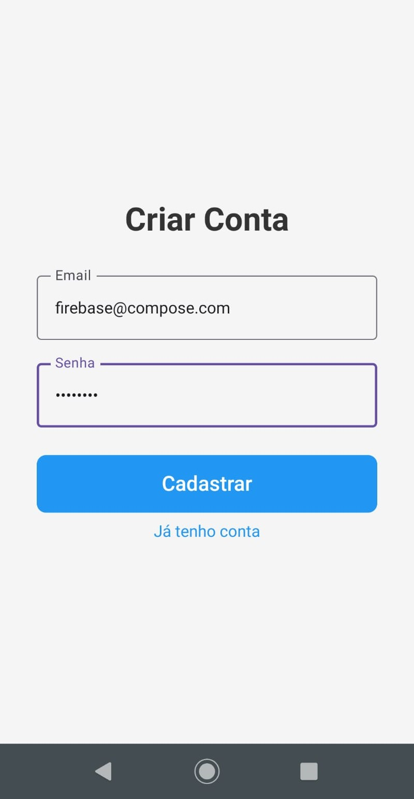
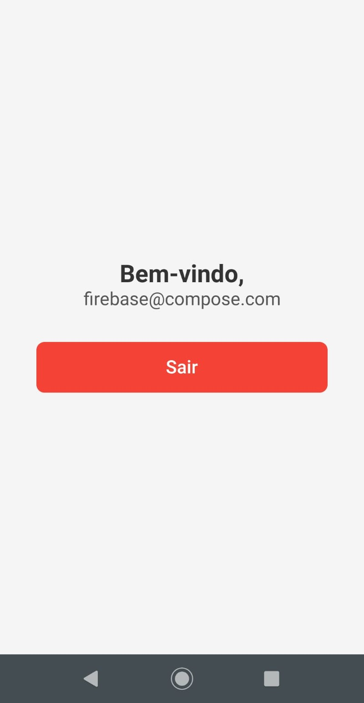

# 🔐 Firebase Login Compose App

A clean and modern Android app built with **Jetpack Compose** and **Firebase Authentication (Email & Password)**.  
Developed entirely in **Kotlin**, using **Compose Navigation** and **Firebase Auth** integration.

---


---

## ✨ Features

- 📝 **User Registration** using Firebase Authentication  
- 🔑 **Login** with Email and Password  
- 👋 **Home Screen** showing personalized welcome message  
- 🚪 **Logout** with automatic navigation back to Login  
- ⚙️ Built with **Jetpack Compose Navigation** (no XML layouts!)  
- 💡 Simple and elegant UI using **only native Compose components**

---

## 🖼️ App Screens

### 📱 Login Screen

- Clean UI with smooth focus handling  
- Keyboard automatically hides after input  
- Navigation to registration and home screens

### 🧾 Register Screen

- Create a new Firebase user  
- Error feedback for invalid email or weak password  

### 🎉 Home Screen

- Displays authenticated user’s email  
- Logout button that clears Firebase session  

---

## 🛠️ Technologies Used

- [Kotlin](https://kotlinlang.org/)  
- [Jetpack Compose](https://developer.android.com/jetpack/compose)  
- [Compose Navigation](https://developer.android.com/jetpack/compose/navigation)  
- [Firebase Authentication](https://firebase.google.com/docs/auth)  
- [AndroidX Libraries](https://developer.android.com/jetpack/androidx)  

---

## 🚀 Getting Started

1. **Clone the repository**
   ```bash
   git clone https://github.com/adrprates/login-firebase-compose.git
   ```

2. **Open the project** in **Android Studio Ladybug+ (2024.1.1+)**

3. **Add Firebase to your project**
   - Go to [Firebase Console](https://console.firebase.google.com/)
   - Create a new project
   - Enable **Email/Password Authentication**
   - Download the `google-services.json` file and place it inside:
     ```
     app/google-services.json
     ```

4. **Sync Gradle** to download dependencies

5. **Run the app** 🚀

---

## 📂 Project Structure

```
com.dm.login_firebase_compose/
│
├── MainActivity.kt
├── navigation/
│   └── AppNavigation.kt
├── ui/screens/
│   ├── LoginScreen.kt
│   ├── RegisterScreen.kt
│   └── HomeScreen.kt
└── ui/theme/
    ├── Color.kt
    ├── Theme.kt
    └── Type.kt
```

---

## ⚡ Dependencies

Main libraries used:
```gradle
implementation(platform("com.google.firebase:firebase-bom:34.2.0"))
implementation("com.google.firebase:firebase-auth")

implementation("androidx.activity:activity-compose:1.9.2")
implementation(platform("androidx.compose:compose-bom:2024.06.00"))
implementation("androidx.compose.ui:ui")
implementation("androidx.compose.material3:material3")
implementation("androidx.navigation:navigation-compose:2.8.3")
```

---

## 🧠 Author

👤 **Adriano Prates**  
📎 [GitHub](https://github.com/adrprates)

---

## 📜 License

This project is licensed under the **MIT License** — feel free to use and modify it.
